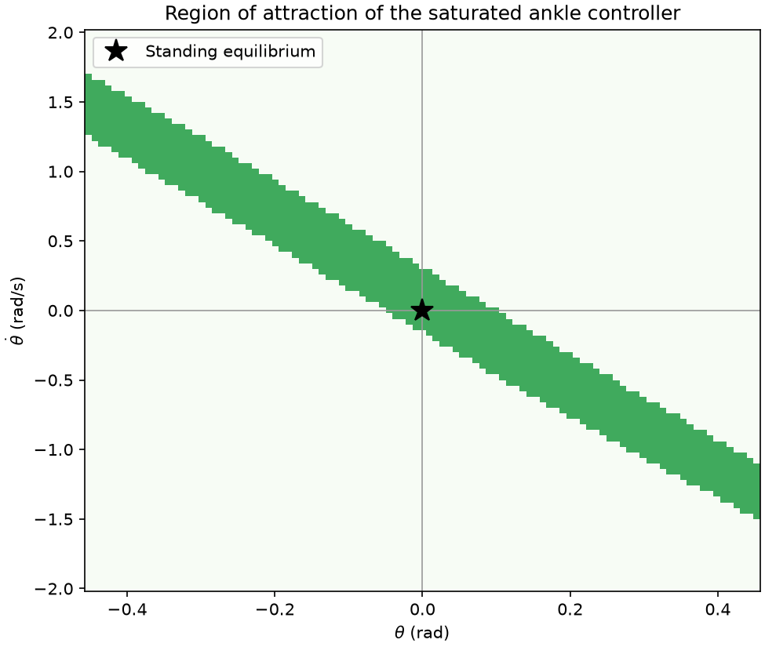
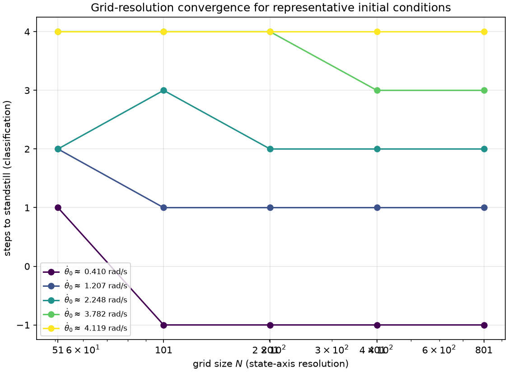
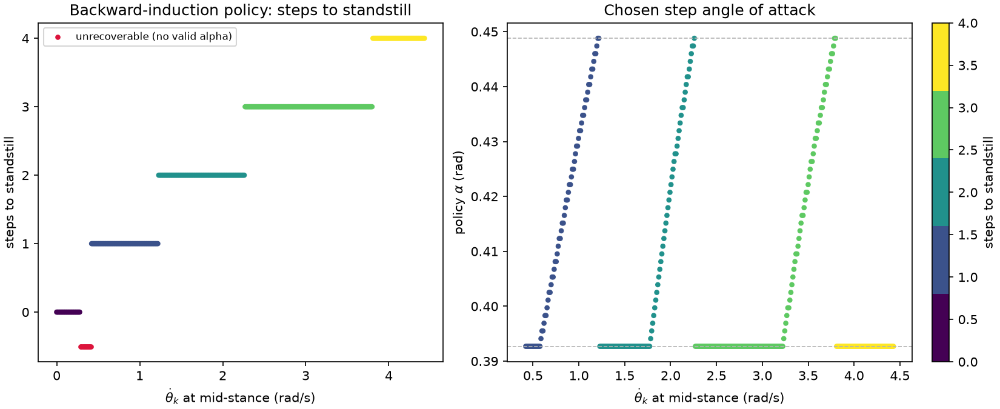
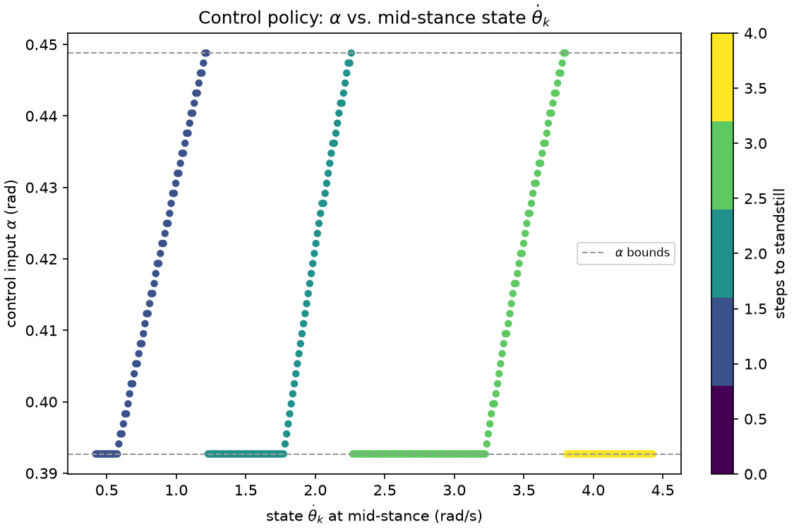
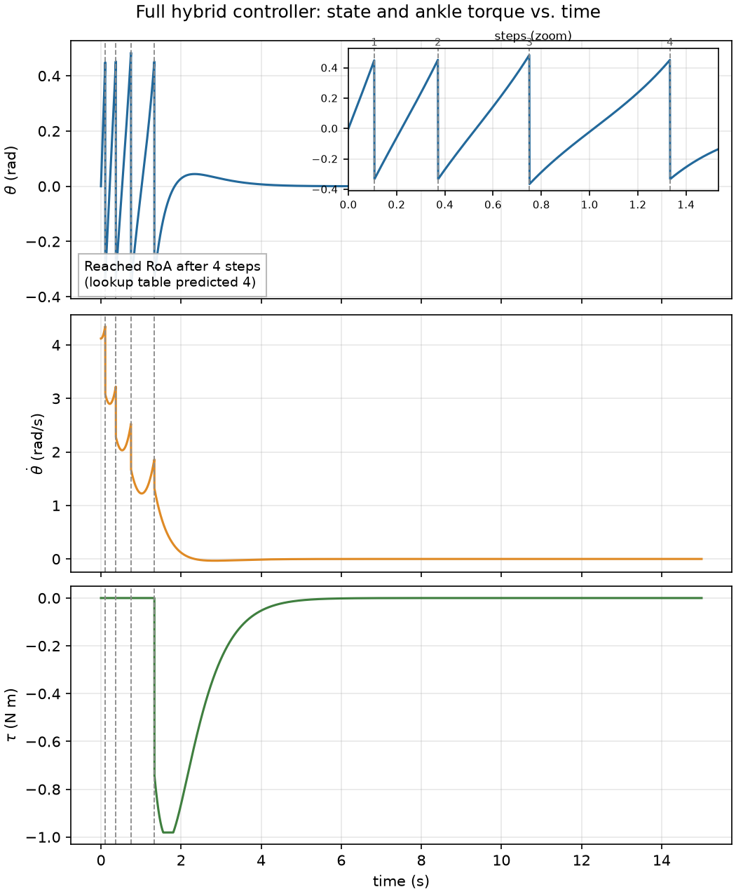
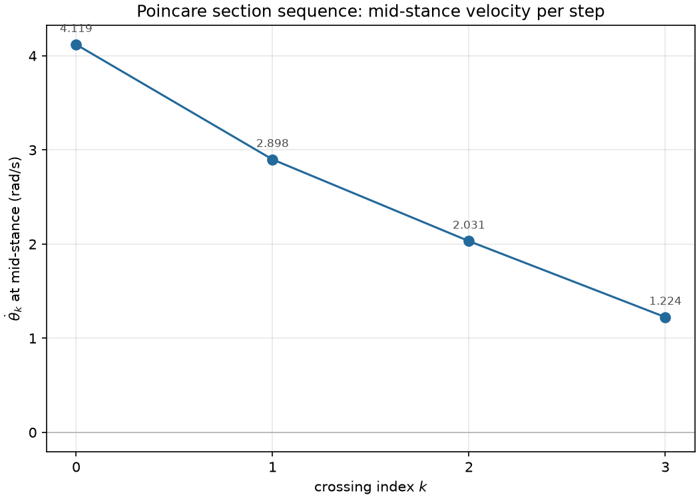
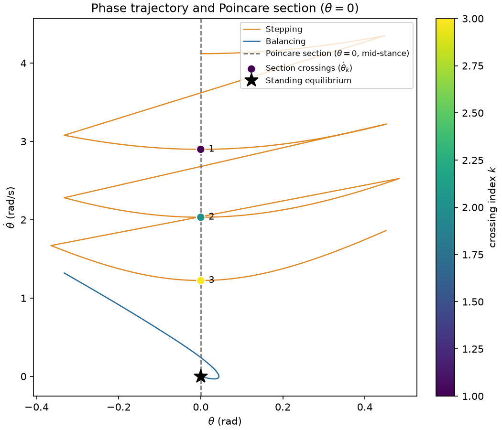
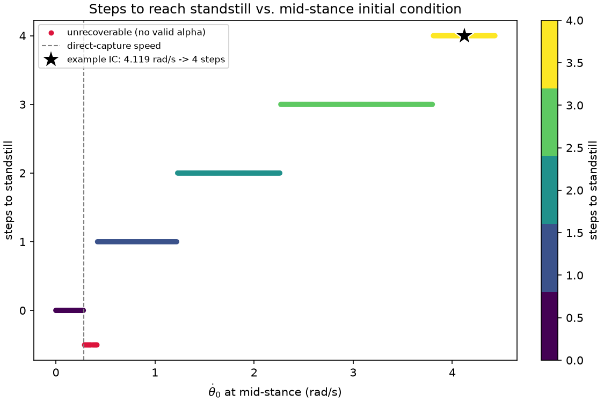

# Assignment 2 — Inverted Pendulum Walker

All numbers and figures below come from a single run of `run_pipeline()` (the shared computation used by both `assignment_2.py`, which shows everything live, and `generate_report_figures.py`, which produced the PNGs referenced here) — so these figures and the numbers quoted alongside them are guaranteed to be mutually consistent.

Model parameters for this run: incline `γ = 0.06 rad`, angle-of-attack bounds `α ∈ [π/8, π/7] ≈ [0.3927, 0.4488] rad`, ankle-torque bounds `τ ∈ [−0.1mgℓ, 0.05mgℓ] ≈ [−0.981, 0.4905] N·m`.

## 1. Region of attraction of the ankle controller

The ankle controller is a saturated feedback-linearizing PD law: it cancels the destabilizing gravity torque `−mgℓ sin(θ)` and adds a critically-damped PD term driving `(θ, θ̇) → (0, 0)`, with the combined torque clipped to the bounds above. Because the torque budget can't fully cancel gravity far from upright, the region where this controller actually converges is finite and irregular, so it's found by a numerical grid search: every point on a 101×101 `(θ, θ̇)` grid is simulated forward under the closed loop for 6 s, and a point is kept if the state has settled within tolerance of the origin without diverging.

Over the swept grid, the RoA covers **11.3%** of the area, and the largest mid-stance velocity the controller can capture directly (i.e. `θ = 0` states that are already inside the RoA, needing zero further steps) is **0.2800 rad/s**.

## 2. Choice of Poincaré section

The section is taken at **mid-stance, θ = 0**. Two things make this the natural choice:

First, it makes θ constant *by construction* on the section — every sample is guaranteed to sit at θ = 0, so the section's own coordinate collapses and the only state left to track is `θ̇`. That's what turns the return map into a clean 1-D map `θ̇_{k+1} = f(θ̇_k, α_k)` rather than something living on a 2-D slice.

Second, and less obviously, mid-stance is independent of the control α, whereas the touchdown event (θ = α + γ) is not: the touchdown angle itself moves with whatever α was chosen for that step. Sectioning at touchdown would tie the section's location to the control input, muddying what "the state at the section" even means. Sectioning at mid-stance sidesteps that: θ = 0 always means the same thing, no matter what α is doing.

A third, practical payoff: because `ankle_torque = 0` throughout the swing phase, specific energy `e = ½θ̇² + (g/ℓ)cos(θ)` is conserved between mid-stance and touchdown, and again between the impact and the next mid-stance. That means the whole mid-stance → mid-stance map can be written in closed form (`poincare_step`) directly from energy conservation plus the impact map, instead of needing numerical integration to build the lookup table — a big part of why the backward-induction table in Section 3 is fast enough to grid-search at all.

## 3. Grid-resolution verification

`build_lookup_table` discretizes the mid-stance velocity axis into `N` points and the angle-of-attack axis into `M` points, then backward-induces `steps_to_stand[i]` (fewest steps to reach the RoA) for each swept `θ̇_i`. `N` is chosen by a convergence check (`choose_grid_resolution`): each candidate grid's classification is resampled onto a common fine reference grid (`N = 4001`) and compared against the next-finer candidate; the coarsest `N` whose disagreement against the next step up falls below 1% is kept.

| N (coarser) | N (finer) | % of grid reclassified |
|---|---|---|
| 51 | 101 | 2.499% |
| 101 | 201 | 1.725% |
| 201 | 401 | 1.600% |
| 401 | 801 | **0.850%** |

`N = 401` is the first candidate whose disagreement against the next step up drops below the 1% tolerance, so that's what's used for the rest of the assignment (`M = 41` for the α axis). At that resolution, the worst case anywhere in the swept range needs **4 steps** to reach the RoA, and **2.99%** of the swept range is unrecoverable (no α in the allowed range avoids a stumble on the very next touchdown).

**Showing that a slightly lower resolution would not have been good enough:** the aggregate percentages above already show `N=201` disagreeing with the reference direction by more than `N=401` does, but a concrete example makes it unambiguous. `find_boundary_theta_dots` locates mid-stance velocities where `N=201`'s classification disagrees with a very fine `N=801` reference — i.e. specific initial conditions a coarser grid gets *wrong*, not just "close." Tracking five such points across every candidate resolution:

| θ̇₀ (rad/s) | N=51 | N=101 | N=201 | N=401 | N=801 |
|---|---|---|---|---|---|
| 0.410 | 1 | −1 | −1 | −1 | −1 |
| 1.207 | 2 | 1 | 1 | 1 | 1 |
| 2.248 | 2 | 3 | 2 | 2 | 2 |
| 3.782 | 4 | 4 | **4** | **3** | 3 |
| 4.119 | 4 | 4 | 4 | 4 | 4 |

The row that matters is `θ̇₀ = 3.782 rad/s`: at `N=201` the lookup table says this state needs **4** steps to reach the RoA, but the true answer (agreed on by both `N=401` and the fine `N=801` reference) is **3** — a full step wrong, not a rounding difference. `N=401` matches the fine reference at every one of these boundary points, while `N=201` still doesn't at this one. That's the concrete evidence that `N=401` was the right cutoff and `N=201` was not yet converged.

## 4. Lookup table and control policy

The left panel of the first figure (and the second figure, shown standalone) is the "steps until stable" visualization: for every swept mid-stance velocity, how many further steps the backward-induction policy needs before the ankle controller can take over, together with the unrecoverable band (crimson, at −1) where no α avoids a stumble. The right panel of the first figure (and the standalone version) is the control input itself: the chosen angle of attack `α_k` as a function of the mid-stance state `θ̇_k`, always within the `[π/8, π/7]` bounds (dashed lines).

## 5. Example trajectory requiring at least 3 steps

The initial condition isn't hand-picked — `choose_example_ic` reads the lookup table's own `steps_to_stand` and takes the actual worst case present in the swept grid, so its own predicted step count *is* the maximum number of steps the walker can continue walking before reaching the RoA for that initial condition (nothing in the sweep takes longer). That gives:

**θ̇₀ = 4.1194 rad/s at mid-stance → 4 steps predicted.**

The closed-loop simulation (full nonlinear dynamics + RK4, not the closed-form map) took exactly **4 steps** to reach the RoA, matching the lookup table's prediction, and settled into balancing at **t = 1.334 s**. The zoomed inset numbers each touchdown along the trajectory.

The same information appears two other ways: as the raw Poincaré-section samples in the order they occurred,

and as a phase-space `(θ, θ̇)` view with the section and its crossings marked directly on the trajectory:

Both show the same energy dissipation story: the mid-stance velocity drops step over step (4.119 → 2.898 → 2.031 → 1.224 rad/s) until the post-impact state finally lands inside the ankle controller's RoA.

## 6. Steps to reach standstill vs. initial condition

This is the standalone visualization of how many steps it takes to reach standstill as a function of the mid-stance initial condition `θ̇₀`: the direct-capture boundary (0.2800 rad/s) is marked, along with the chosen example initial condition and its 4-step outcome, on top of the full `steps_to_stand` curve from the lookup table.

---

*Figures generated by `generate_report_figures.py`, which shares its computation (`run_pipeline()`) with `assignment_2.py`. Re-run either script to regenerate these numbers from scratch.*